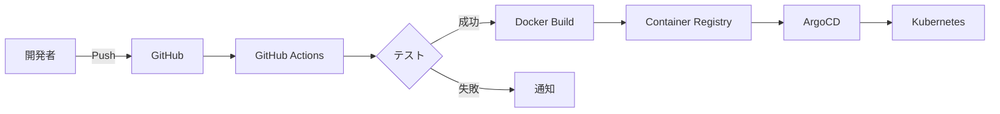

# CI/CD パイプライン設定ガイド

## 概要

このプロジェクトでは、GitHub Actions を使用した CI/CD パイプラインと、ArgoCD による GitOps デプロイメントを実装しています。

## CI/CD フロー



## GitHub Actions ワークフロー

### 1. CI ワークフロー（`.github/workflows/ci.yml`）

- **トリガー**: main/develop ブランチへの push、PR
- **ジョブ**:
  - テスト実行（単体テスト、統合テスト）
  - コード品質チェック（format、credo、dialyzer）
  - Docker イメージのビルドとプッシュ
  - Kubernetes マニフェストの更新

### 2. リリースワークフロー（`.github/workflows/release.yml`）

- **トリガー**: タグの作成（v*）
- **ジョブ**:
  - プロダクションビルド
  - GitHub Release の作成
  - 本番環境へのデプロイトリガー

### 3. セキュリティスキャン（`.github/workflows/security.yml`）

- **トリガー**: 毎週月曜日、main/develop への push
- **ジョブ**:
  - 依存関係の脆弱性チェック
  - コンテナイメージのスキャン
  - シークレットスキャン

## Docker 設定

### マルチステージビルド

各サービスの Dockerfile は以下の構成：

1. **ビルドステージ**: 依存関係のインストールとコンパイル
2. **ランタイムステージ**: 最小限のランタイムイメージ

### イメージ管理

- **レジストリ**: GitHub Container Registry (ghcr.io)
- **タグ戦略**:
  - `latest`: main ブランチの最新
  - `dev-latest`: develop ブランチの最新
  - `v1.0.0`: リリースタグ
  - `main-abc123`: コミット SHA 付き

## Kubernetes デプロイメント

### Kustomize 構成

```
k8s/
├── base/                    # 基本設定
│   ├── namespace.yaml
│   ├── configmap.yaml
│   ├── secret.yaml
│   └── *-deployment.yaml
└── overlays/               # 環境別設定
    ├── development/
    ├── staging/
    └── production/
```

### 環境別の違い

| 項目 | Development | Staging | Production |
|------|-------------|---------|------------|
| レプリカ数 | 1 | 2 | 3+ |
| リソース制限 | 低 | 中 | 高 |
| オートスケール | なし | あり | あり |
| モニタリング | 基本 | 詳細 | 完全 |

## ArgoCD による GitOps

### アプリケーション定義

```yaml
# argocd/application.yaml
apiVersion: argoproj.io/v1alpha1
kind: Application
metadata:
  name: elixir-cqrs
spec:
  source:
    repoURL: https://github.com/your-org/elixir-cqrs
    path: k8s/overlays/production
  destination:
    server: https://kubernetes.default.svc
  syncPolicy:
    automated:
      prune: true
      selfHeal: true
```

### 同期ポリシー

- **自動同期**: main ブランチの変更を自動デプロイ
- **自己修復**: 手動変更を自動的に Git の状態に戻す
- **プルーニング**: Git から削除されたリソースを自動削除

## シークレット管理

### 開発環境

```bash
# .env ファイルの使用
cp .env.example .env
# 必要な値を編集
```

### 本番環境

1. **GitHub Secrets** に保存
2. **Sealed Secrets** で暗号化
3. **External Secrets Operator** で外部管理

### シークレットローテーション

```bash
# 手動実行
./scripts/generate-secrets.sh production

# GitHub Actions で実行
# .github/workflows/secrets-scan.yml の workflow_dispatch
```

## デプロイメントフロー

### 開発環境

1. feature ブランチで開発
2. develop ブランチへ PR
3. CI テスト実行
4. マージ後、自動デプロイ

### ステージング環境

1. develop から staging ブランチへ PR
2. 統合テスト実行
3. 手動承認後、デプロイ

### 本番環境

1. リリースタグの作成
2. リリースワークフロー実行
3. 手動承認
4. ArgoCD による段階的デプロイ

## モニタリングとアラート

### メトリクス

- **Prometheus**: システムメトリクス
- **Grafana**: ダッシュボード
- **Jaeger**: 分散トレーシング

### アラート設定

```yaml
# 例: レスポンスタイムアラート
- alert: HighResponseTime
  expr: http_request_duration_seconds{quantile="0.99"} > 1
  for: 5m
  annotations:
    summary: "High response time detected"
```

## トラブルシューティング

### ビルドエラー

```bash
# ローカルでの再現
docker build -f apps/client_service/Dockerfile .
```

### デプロイエラー

```bash
# ArgoCD の状態確認
argocd app get elixir-cqrs --refresh

# 手動同期
argocd app sync elixir-cqrs
```

### ロールバック

```bash
# 前のバージョンに戻す
argocd app rollback elixir-cqrs REVISION

# または Git でリバート
git revert HEAD
git push
```

## ベストプラクティス

1. **ブランチ保護**: main ブランチは直接 push 禁止
2. **PR レビュー**: 最低 1 人のレビュー必須
3. **テストカバレッジ**: 80% 以上を維持
4. **セキュリティスキャン**: 週次で自動実行
5. **ドキュメント**: 変更時は必ず更新

## 次のステップ

1. [ ] Istio によるサービスメッシュの導入
2. [ ] Flagger によるカナリアデプロイ
3. [ ] Tekton によるパイプラインの拡張
4. [ ] OPA によるポリシー管理